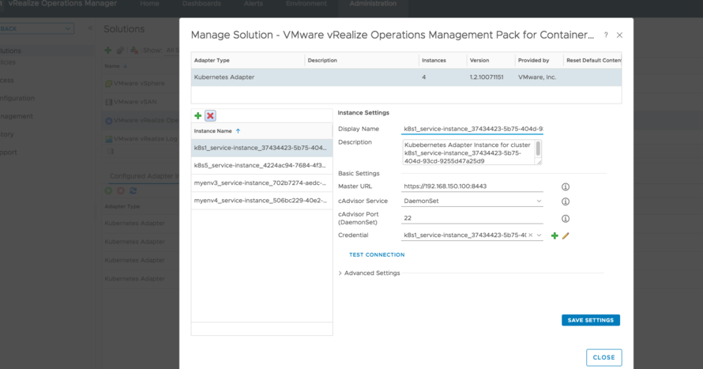
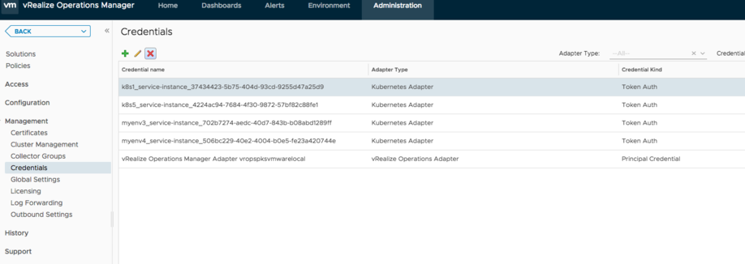

# How vrops talk with cAdvisor?
1. vrops talk to k8s api server
2. k8s api server proxy requests to cAdvisor deamonset

vrops won't talk directly with cAdvisor in work nodes

# How to cleanup vrops container service adapter?

1. Go to `VROPS management pack for container`, then remove the item

Administrator Menu -> Solutions -> Management Pack

2. Go to `token auth`

Administrator -> Management -> Credentials

